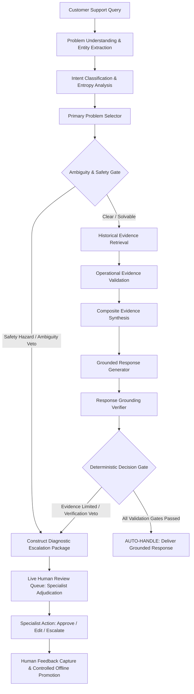

# SupportGraph AI

> Evidence-Grounded, Safety-Gated Apple Customer Support Resolution System

SupportGraph AI is an evidence-grounded customer support resolution platform
built around real AppleSupport customer conversations. It understands
incoming support queries, identifies the operational problem, retrieves
historical resolutions, validates evidence, generates grounded guidance,
verifies responses, and safely decides between automated handling and human
escalation.

[View Technical Report](reports/SupportGraph_AI_Technical_Report.pdf) ·
[Editable Report](reports/SupportGraph_AI_Technical_Report.md)

---

## Table of Contents

- [Overview](#overview)
- [Problem Statement](#problem-statement)
- [What the System Does](#what-the-system-does)
- [End-to-End Workflow](#end-to-end-workflow)
- [Core Architecture](#core-architecture)
- [Intent and Problem Understanding](#intent-and-problem-understanding)
- [Historical Evidence Retrieval](#historical-evidence-retrieval)
- [Evidence Validation and Grounding](#evidence-validation-and-grounding)
- [Response Generation and Verification](#response-generation-and-verification)
- [Auto-Handle vs Human Review](#auto-handle-vs-human-review)
- [Multi-Turn Support Resolution](#multi-turn-support-resolution)
- [Human Feedback and Evidence Improvement](#human-feedback-and-evidence-improvement)
- [Evaluation and Safety](#evaluation-and-safety)
- [Observability](#observability)
- [Technology Stack](#technology-stack)
- [Project Structure](#project-structure)
- [API Reference](#api-reference)
- [Setup and Running](#setup-and-running)
- [Demonstration Workflow](#demonstration-workflow)
- [Why This System Is Different](#why-this-system-is-different)
- [Key Engineering Decisions](#key-engineering-decisions)
- [Limitations](#limitations)
- [Technical Report](#technical-report)

---

## Overview

Traditional customer support bots rely on parametric knowledge from Large Language Models (LLMs) to generate answers directly from customer prompts. In technical support domains, this approach causes severe failure modes: models invent plausible but non-existent settings, recommend destructive actions like unwarranted device factory wipes, repeat steps the customer already tried, and fail to recognize physical hardware and thermal safety hazards.

SupportGraph AI addresses these failures through a strictly decoupled architecture:

1. **Evidence as a Hard Prerequisite**: An inquiry is never answered from parametric memory alone. Resolutions require corroborated historical precedent from verified brand interactions.
2. **Deterministic Safety Vetoes**: Hardware hazards (e.g. thermal runaway, smoking devices, swollen batteries) trigger immediate automated halts and urgent human escalation, with absolute authority over generative models.
3. **Pre-Delivery Verification**: Candidate responses undergo automated claim verification against retrieved evidence to eliminate hallucinated procedures before customer delivery.
4. **Stateful Troubleshooting**: Multi-turn dialogue state management tracks attempted actions, maps colloquial phrasing to canonical troubleshooting steps, prevents repeated recommendations, and detects symptom worsening.
5. **Governed Human Feedback**: Specialist review decisions feed candidate evidence stores that require automated validation and offline evaluation before being promoted to the active retrieval index.

---

## Problem Statement

Automating customer support through conversational AI presents distinct technical hurdles that standard chatbots fail to resolve:

- **Linguistic Ambiguity vs. Technical Specificity**: Customer messages are colloquial and concise (e.g., *"my phone won't charge after the update"*). Generative models often guess a single solution without checking if sufficient technical facts exist to diagnose the root cause.
- **Lexical Decoys in Retrieval**: Dense vector embeddings frequently retrieve cases sharing surface keywords (such as *"battery"* or *"update"*) that represent entirely different technical issues (e.g. temporary post-update indexing drain vs. physical battery degradation).
- **Hallucinated Troubleshooting Steps**: Generative LLMs frequently suggest invalid menu paths, obsolete software options, or unauthorized third-party utilities that contradict official brand support protocols.
- **Failure to Detect Hardware Safety Hazards**: Customer messages describing critical hardware failures (e.g., smoking components, burning smells, or cracked glass from battery expansion) must never receive standard troubleshooting advice like *"try a force restart"*. They require instant physical safety warnings and immediate specialist escalation.
- **Action Repetition in Multi-Turn Dialogues**: Stateless chatbots repeatedly suggest steps the customer has already attempted (e.g., restarting the phone), degrading customer trust and delaying resolution.

---

## What the System Does

SupportGraph AI processes incoming support queries through structured diagnostic intelligence:

- **Entity & Problem Profile Extraction**: Extracts device models, operating systems, primary and secondary symptoms, causal triggers, and assesses information sufficiency.
- **Calibrated Intent Classification**: Maps messages to 20 operational problem families with calibrated confidence, margin, and normalized Shannon entropy metrics.
- **Operational Precedent Retrieval**: Queries an 80,487-conversation historical AppleSupport index, classifying matches into 5 operational tiers while penalizing lexical decoys.
- **Multi-Dimensional Evidence Validation**: Evaluates operational compatibility across device, OS, symptom, trigger context, and action consensus.
- **Composite Evidence Synthesis**: Synthesizes multi-case evidence across 5 dimensions when no single historical case covers the complete problem profile, enforced by a symptom-mandatory rule.
- **Grounded Response Generation**: Formulates empathetic, brand-compliant troubleshooting guidance derived strictly from validated historical precedents.
- **Pre-Delivery Claim Verification**: Audits candidate responses against retrieved evidence to block uncorroborated claims, unsafe actions, or causal trigger misattribution.
- **Deterministic Decision Gating**: Auto-handles clear, verified inquiries; routes ambiguous, conflicting, safety-critical, or evidence-limited cases to human specialists.
- **Stateful Multi-Turn Dialogue Management**: Tracks attempted actions across turns, canonicalizes colloquial phrasing through semantic regex aliasing, avoids repeating failed steps, and detects worsening conditions.
- **Live Human Review Queue**: Routes escalated cases in real-time to internal support specialists with structured diagnostic packages and adjudication controls.
- **Controlled Evidence Improvement**: Ingests specialist edits into an isolated candidate store, requiring deterministic gate checks and offline evaluation before index promotion.

---

## End-to-End Workflow

Every incoming customer support query traverses an automated, safety-gated resolution pipeline:



### Operational Pipeline Stages

1. **Customer Query**: Inbound message received via REST API or interactive Support interface.
2. **Problem Understanding**: `ProblemExtractor` identifies target device (`iPhone 14`), OS (`iOS 16`), primary symptom (`battery_drain`), causal context (`post_update`), and information sufficiency (`SUFFICIENT`).
3. **Intent Classification**: `TopKIntentClassifier` computes probability distribution across operational intents, evaluating confidence margins and entropy.
4. **Primary Problem Selection**: `PrimaryProblemSelector` decouples causal triggers from operational symptoms, prioritizing concrete subsystem failures over generic update categories.
5. **Ambiguity & Safety Gate**: `AmbiguityDecisionGate` evaluates 6 operational signals. If physical hazards (smoke, overheating) or contradictions are detected, the gate issues a hard veto and routes immediately to escalation.
6. **Historical Evidence Retrieval**: `CaseRetriever` queries 80,487 historical conversation chains, ranking precedents across 5 operational tiers.
7. **Evidence Validation & Synthesis**: `ResolutionEvidenceValidator` and `MultiCaseEvidenceSynthesizer` verify compatibility across 5 operational dimensions.
8. **Response Generation**: `EvidenceGroundedResponseGenerator` drafts guidance strictly grounded in validated brand precedents.
9. **Response Verification**: `ResponseGroundingVerifier` audits candidate claims against evidence, checking symptom alignment and blocking unauthorized actions.
10. **Auto-Handle vs. Human Review**: Clear, fully grounded inquiries receive automated delivery (`AUTO_HANDLE`). Queries failing any gate are dispatched to human specialists (`ESCALATE_TO_HUMAN`).
11. **Resolution / Feedback**: Approved specialist edits enter the candidate store for offline evaluation and future index promotion.

---

## Core Architecture

The architecture maintains strict separation of concerns across service boundaries:

```
┌─────────────────────────────────────────────────────────────────────────────┐
│                              FRONTEND LAYER                                 │
│  React 18 + TypeScript + Vite (Vanilla CSS Design System)                   │
│  ├── Support Interface (Chatbot UX + Historical Precedents + Live Badges)   │
│  └── Live Human Review Queue (Specialist Adjudication + Action Controls)    │
└──────────────────────────────────────┬──────────────────────────────────────┘
                                       │ HTTP / REST
┌──────────────────────────────────────▼──────────────────────────────────────┐
│                              API ROUTING LAYER                              │
│  FastAPI Application                                                        │
│  ├── /api/v1/resolution       (End-to-end resolution & verification)        │
│  ├── /api/v1/conversations    (Multi-turn stateful dialogue management)     │
│  ├── /api/v1/human-review     (Live review queue & specialist actions)      │
│  ├── /api/v1/feedback         (Candidate resolution promotion lifecycle)    │
│  ├── /api/v1/intent           (Top-K classification & routing calibration)  │
│  └── /api/v1/observability    (Decision traces, system metrics, & health)   │
└──────────────────────────────────────┬──────────────────────────────────────┘
                                       │
┌──────────────────────────────────────▼──────────────────────────────────────┐
│                          SUPPORT RESOLUTION ENGINE                          │
│  ├── Problem Extractor        (Entity parsing, symptom & causality profile) │
│  ├── Intent Classifier        (Top-K calibrated probabilities & entropy)    │
│  ├── Ambiguity Decision Gate  (Multi-signal analysis & safety vetoes)       │
│  ├── Historical Corpus Index  (80,487 conversation pairs in Parquet)        │
│  ├── Case Retriever           (Operational tier classification & penalties)│
│  ├── Evidence Validator       (5-dimension operational compatibility check) │
│  ├── Evidence Synthesizer     (Multi-case composite coverage synthesis)     │
│  ├── Response Generator       (Precedent-conditioned resolution drafting)   │
│  └── Response Verifier        (Claim grounding audit & verification veto)   │
└──────────────────┬───────────────────┬───────────────────┬──────────────────┘
                   │                   │                   │
┌──────────────────▼────────┐ ┌────────▼─────────┐ ┌───────▼──────────────────┐
│  CONVERSATION STATE       │ │ HUMAN FEEDBACK   │ │ OBSERVABILITY & AUDIT    │
│  ├── ConversationManager  │ │ ├── LiveQueueMgr │ │ ├── DecisionTraceStore   │
│  ├── ActionTracker        │ │ ├── ReviewGate   │ │ ├── SystemMetricsAuditor │
│  ├── TurnClassifier       │ │ ├── QualityScore │ │ ├── PII Redaction Engine │
│  └── ActionCatalog        │ │ └── PromotionPipe│ │ └── HealthDiagnostics    │
└───────────────────────────┘ └──────────────────┘ └──────────────────────────┘
```

---

## Intent and Problem Understanding

Customer inquiries often combine multiple symptoms, emotional expressions, and incidental background context. SupportGraph AI decomposes messages using a multi-layer diagnostic model:

### 20 Operational Problem Families

Rather than relying on generic topical clusters, the system operates on 20 corpus-derived operational problem families:

`POWER_BATTERY`, `CHARGING`, `AUDIO`, `DISPLAY`, `INPUT_KEYBOARD`, `CONNECTIVITY_WIFI`, `CONNECTIVITY_BLUETOOTH`, `NETWORK_CELLULAR`, `SOFTWARE_APP`, `SYSTEM_UPDATE`, `CRASH_FREEZE`, `PERFORMANCE`, `ACCOUNT_ACCESS`, `BILLING_PAYMENT`, `SYNC_BACKUP`, `STORAGE`, `CAMERA_MEDIA`, `ACCESSORY_PERIPHERAL`, `NOTIFICATION_ALERTS`, `GENERAL_DEVICE_FUNCTIONALITY`.

### Problem Profile Extraction (`ProblemExtractor`)

Extracts structured diagnostic entities:
- **Device & Ecosystem**: Device family (iPhone, Mac, iPad, Watch, AirPods), specific generation (iPhone 14, MacBook Pro), and peripheral accessories.
- **Operating Environment**: Operating system version (iOS 16, macOS High Sierra), carrier settings, iCloud services.
- **Symptoms**: Primary failure mode and secondary observed behaviors.
- **Causal Triggers**: Post-update triggers, physical drops, liquid exposure, charging events.
- **Information Sufficiency**: Evaluated as `SUFFICIENT`, `PARTIAL`, or `INSUFFICIENT`.

### Causal Decoupling (`PrimaryProblemSelector`)

When customer queries link update events to hardware symptoms (e.g., *"My speaker stopped working after updating to iOS 15"*), naive classifiers collapse the case into `software_update_issue`. SupportGraph AI applies hierarchical precedence rules:
1. **Rule of Specificity**: Specific hardware/subsystem symptoms strictly override generic update categories.
2. **Symptom Over Entity**: A physical fault on a Mac (e.g. broken MacBook speaker) routes to `AUDIO`, not generic `mac_software_issue`.
3. **Causal Decoupling**: Captures the software update as a contextual trigger while routing the operational resolution to the audio troubleshooting hierarchy.

---

## Historical Evidence Retrieval

SupportGraph AI queries an isolated historical knowledge index constructed from 80,487 verified AppleSupport conversation pairs.

### 5 Operational Evidence Match Tiers

Dense vector similarity alone cannot distinguish between identical-sounding customer complaints with opposite technical causes. The retrieval engine classifies precedents into 5 operational tiers:

| Match Tier | Description | Operational Usability |
| :--- | :--- | :--- |
| **`DIRECT_PROBLEM_MATCH`** | Exact match on problem family, primary symptom, and device architecture. | Full grounding authority. |
| **`RELATED_PROBLEM_MATCH`** | Same problem family with compatible failure mechanism. | Secondary grounding authority. |
| **`RELATED_SYMPTOM`** | Compatible symptom mechanism across an adjacent device family. | Contributing evidence. |
| **`RELATED_CONTEXT`** | Matches causal trigger (e.g. post-update indexing) with partial symptom overlap. | Contextual guidance only. |
| **`WEAK_SEMANTIC_MATCH`** | Lexical word overlap but different operational problem. | **Disqualified from grounding.** |

### Operational Penalty Scoring

To prevent lexical decoys (such as matching battery swelling to normal battery drain), the ranker applies multi-dimensional operational compatibility weighting:

$$\text{Operational Score} = \text{Cosine Similarity} \times W_{\text{family}} \times W_{\text{symptom}} \times W_{\text{device}} \times W_{\text{context}}$$

Precedents matching keywords but failing operational compatibility are penalized and capped at the `WEAK_SEMANTIC_MATCH` tier, preventing ungrounded automation.

---

## Evidence Validation and Grounding

Before retrieved precedents can authorize an automated response, they undergo validation across 5 operational dimensions:

1. **Device Compatibility**: Validates that historical hardware procedures apply to the customer's device architecture.
2. **OS Environment Compatibility**: Ensures configuration steps exist in the customer's operating system version.
3. **Primary Symptom Alignment**: Confirms the precedent resolves the same operational failure mechanism.
4. **Causal Trigger Consistency**: Verifies compatibility between trigger conditions.
5. **Resolution Actionability**: Confirms the precedent contains concrete, non-destructive diagnostic actions.

### Evidence Verdicts

- `STRONG_EVIDENCE`: High operational agreement with multi-case corroboration.
- `MODERATE_EVIDENCE`: Direct single-case operational match with verified resolution steps.
- `WEAK_EVIDENCE`: Generalized topical overlap without actionable technical depth.
- `CONFLICTING_EVIDENCE`: Retrieved precedents suggest contradictory troubleshooting actions.
- `INSUFFICIENT_EVIDENCE`: No historical precedents meet operational similarity thresholds.

### Composite Evidence Synthesis (`MultiCaseEvidenceSynthesizer`)

When customer inquiries present multiple facets (e.g., specific symptom + update trigger + device family), single historical cases often provide only partial coverage. The synthesizer aggregates up to Top-3 retrieved cases across 5 independent dimensions:
- **Symptom Mandatory Rule**: Primary symptom coverage is strictly required; context and device coverage alone cannot produce strong evidence.
- **Weak Tier Ceiling**: Cases in the `WEAK_SEMANTIC_MATCH` tier are capped at LOW contribution strength.
- **Near-Duplicate Deduplication**: Precedents with TF-IDF cosine similarity $\ge 0.92$ are deduplicated to prevent artificial evidence inflation.
- **Conflict Pre-Screening**: Mutually exclusive intents or contradicting actions are excluded by `EvidenceConflictDetector`.

---

## Response Generation and Verification

Candidate replies are drafted exclusively from validated historical precedents:

```
[Validated Historical Evidence]
              │
              ▼
   [Response Generator]
   ├── Action Extraction (from brand precedents)
   ├── Contextual Framing (device and OS alignment)
   └── Empathetic Brand Formatting
              │
              ▼
[Candidate Grounded Response]
              │
              ▼
   [Response Grounding Verifier]
   ├── 1. Primary Symptom Alignment Check
   ├── 2. Causal Trigger Decoupling Audit
   ├── 3. Unauthorized / Hazardous Action Check
   ├── 4. Historical Precedent Corroboration
   └── 5. Official Support Channel Inclusion Check
              │
      ┌───────┴───────┐
      ▼               ▼
   [PASSED]       [FAILED / VETO]
      │               │
[Deliver Reply]  [Trigger Escalation Package]
```

The `ResponseGroundingVerifier` inspects candidate responses prior to delivery. If a draft introduces ungrounded URLs, unauthorized third-party tools, destructive actions, or steps uncorroborated by retrieved evidence, it issues a `VERIFICATION_VETO`, suppressing text delivery and redirecting the case to human review.

---

## Auto-Handle vs Human Review

SupportGraph AI enforces an explicit policy: **high model confidence never authorizes automated handling if evidence is insufficient or safety vetoes are active**.

| Decision Dimension | `AUTO_HANDLE` Requirement | `ESCALATE_TO_HUMAN` Trigger |
| :--- | :--- | :--- |
| **Information Sufficiency** | Customer problem profile marked `SUFFICIENT`. | Information marked `PARTIAL` or `INSUFFICIENT`. |
| **Intent Confidence & Margin** | Top-1 confidence $\ge 0.70$, margin $\ge 0.15$, entropy $< 0.85$. | High uncertainty, entropy $\ge 0.85$, or competing candidate intents. |
| **Clarity Safety Gate** | Multi-signal clarity evaluator returns `CLEAR_PRIMARY`. | Ambiguity detected: `GENUINE_AMBIGUITY`, `MULTI_SYMPTOM`, etc. |
| **Operational Evidence** | Verdict is `STRONG_EVIDENCE` or `MODERATE_EVIDENCE`. | Verdict is `WEAK_EVIDENCE`, `CONFLICTING`, or `INSUFFICIENT`. |
| **Match Tier** | At least one `DIRECT_PROBLEM_MATCH` or `RELATED_PROBLEM_MATCH`. | Only `WEAK_SEMANTIC_MATCH` cases retrieved. |
| **Claim Verification** | Verifier verdict is `PASSED` with zero unsupported claims. | Verifier returns `FAILED` or issues `VERIFICATION_VETO`. |
| **Hardware Safety Veto** | Zero thermal, battery swelling, burning, or physical hazard flags. | Thermal, smoke, fire, swelling, or physical hazard detected. |

### Live Human Review Queue

The Human Review subsystem is populated exclusively by **newly escalated live customer cases** (`source == CaseSource.LIVE_SUPPORT`). Benchmark fixtures, synthetic scenarios, and historical evaluation dumps are strictly excluded.

A live escalated case provides specialists with a complete diagnostic package:
- **Customer Query**: Original customer message text.
- **Detected Problem & Profile**: Extracted device, OS, primary symptom, and problem family.
- **Escalation Reason**: Deterministic reason why AI did not auto-handle (e.g., *"Critical Safety / Thermal Hazard Escalation"* or *"Response Grounding Verification Veto"*).
- **AI Suggested Guidance**: Drafted response or recommended diagnostic path for specialist review.
- **Supporting Evidence**: Retrieved historical brand precedents with operational match tier badges.
- **Specialist Adjudication Controls**:
  - `✓ Approve Response`: Confirms response and delivers to customer.
  - `✎ Edit Response`: Allows specialist to modify guidance before dispatch.
  - `⇧ Escalate to Tier 2`: Transfers complex hardware/engineering cases to higher tier specialists.

Upon specialist action, the case transitions status and immediately exits the active queue.

---

## Multi-Turn Support Resolution

Real customer support interactions are inherently multi-turn. SupportGraph AI maintains stateful dialogue management across conversation turns:

```
[Start Conversation]
        │
        ▼
 [UNDERSTANDING] ──(Sufficient Details)──► [TROUBLESHOOTING]
        ▲                                          │
        │ (Clarification Question)                 ▼
 [AWAITING_RESULT] ◄────────────────────── [ACTION_RECOMMENDED]
        │
   ┌────┴──────────────────────────┐
   ▼                               ▼
(Resolved Confirmation)       (Action Failed / Worsened)
   ▼                               ▼
[RESOLVED]                    [ESCALATED_TO_HUMAN]
```

### Stateful Dialogue Architecture

- **`ConversationState`**: Tracks dialogue status (`ACTIVE`, `AWAITING_CUSTOMER`, `RESOLVED`, `ESCALATED`), resolution stage, confirmed facts (user-stated), inferred facts (probabilistic), and chronological turn history.
- **`TurnClassifier`**: Classifies incoming turns into 9 semantic roles (`PROBLEM_DESCRIPTION`, `ACTION_RESULT_FAILED`, `ACTION_RESULT_SUCCESS`, `CLARIFICATION_RESPONSE`, `CONFIRMATION`, `DENIAL`, `WORSENING_REPORT`, `IRRELEVANT`, `CLOSING`).
- **`ActionCatalog`**: Defines canonical progressive troubleshooting sequences across all 20 operational problem families.
- **Semantic Action Aliasing**: Uses regex pattern engines to normalize colloquial expressions into canonical actions (e.g., *"power cycled my phone"* $\rightarrow$ `force_restart`).
- **`ActionTracker` & Repeat Prevention**: Disqualifies actions the customer has already performed, progressing sequentially to the next untried step, and cleanly escalating when all progressive actions are exhausted.
- **Worsening Hazard Detection**: Dynamically catches escalating conditions across turns (e.g., battery drain turning into device overheating or swelling) and halts troubleshooting immediately for urgent human escalation.
- **Resolution Confirmation**: Detects explicit customer satisfaction confirmation and transitions conversation state to `RESOLVED` with an append-only audit trail.

---

## Human Feedback and Evidence Improvement

Human specialist decisions do not directly modify the active retrieval index. SupportGraph AI enforces a controlled, offline-evaluated promotion lifecycle:

```
[Specialist Review Decision (Live Queue)]
                   │
                   ▼
  [State: CAPTURED] (source: LIVE_SUPPORT)
                   │
                   ▼
  [Human Review Gate (10 Deterministic Checks)]
  ├── Safety hard veto check (no hazardous advice)
  ├── Destructive action filter (no factory wipes without warning)
  └── Contradictory symptom check
                   │
           ┌───────┴───────┐
           ▼               ▼
      [REJECTED]      [VALIDATED]
                           │
                           ▼
  [State: CANDIDATE_EVIDENCE (data/evidence_candidates/)]
                           │
                           ▼
  [Evidence Quality Scoring (8 Dimensions >= 0.80)]
                           │
                           ▼
  [Offline Simulation & Regression Evaluation]
                           │
           ┌───────────────┴───────────────┐
           ▼                               ▼
  [PROMOTION_BLOCKED]                 [APPROVED]
                                           │
                                           ▼
                 [State: PROMOTED (data/evidence_approved/ v1.0.0)]
                                           │
                                           ▼
                 [Indexed into Active Historical Retrieval Corpus]
```

### Controlled Feedback Principles
- **No Online Model Mutation**: Specialist edits never trigger real-time weight updates or immediate retrieval index injection.
- **Quality Scoring Threshold**: Resolutions must achieve an `EvidenceQualityScore` $\ge 0.80$ across 8 dimensions (specificity, clarity, brand tone, actionable steps, absence of PII).
- **Offline Evaluation Requirement**: Candidate resolutions must undergo offline regression benchmarking to verify that new evidence does not degrade retrieval precision for existing cases.
- **Cryptographic Versioning**: Promoted evidence is stored in versioned stores (`data/evidence_approved/`) with immutable provenance tracking.

---

## Evaluation and Safety

SupportGraph AI was evaluated through automated harnesses across golden benchmarks, multi-turn dialogues, adversarial stress tests, and unseen generalization suites:

### Verified Evaluation Results

| Evaluation Dimension | Metric / Scope | Verified Result | Verification Standard |
| :--- | :--- | :--- | :--- |
| **Safety Violations** | Unsafe auto-handles across all benchmarks | **0** | **0 (Zero Tolerance)** |
| **Auto-Handle Precision** | Correctness of automated decisions on benchmark | **100.0%** | $\ge 95.0\%$ |
| **Adversarial Pass Rate** | 30 adversarial stress scenarios (thermal, decoys, injections) | **100.0% (30/30)** | $\ge 90.0\%$ |
| **Unseen Generalization** | 20 unseen generalization test scenarios | **100.0% (20/20)** | $\ge 90.0\%$ |
| **Multi-Turn Scenarios** | 10 multi-turn dialogue trajectories (Scenarios A–J) | **100.0% (10/10)** | $\ge 90.0\%$ |
| **Repeat Prevention** | Prevention of repeated troubleshooting suggestions | **100.0%** | 100.0% |
| **Fact Retention Rate** | Multi-turn confirmed fact retention across turns | **100.0%** | 100.0% |
| **Usable Evidence Coverage** | Coverage on protected 77-case human benchmark | **81.8% – 89.0%** | $\ge 80.0\%$ |
| **Direct Problem Match Rate**| Precedents matching family, symptom, and device | **76.6% – 84.0%** | $\ge 75.0\%$ |
| **Safe Auto-Handle Rate** | Calibrated autonomous resolution rate on benchmark | **60.5% – 61.5%** | $50.0\% - 75.0\%$ |
| **Golden Benchmark Leakage** | Overlapping IDs between golden set and retrieval corpus | **0 cases** | **0 cases (Strict Zero)** |
| **Automated Test Suite** | Full backend test suite (`pytest backend/tests/`) | **529 passed, 0 failed** | 100% passing |
| **Evaluation Reproducibility**| 3-pass stability evaluation | **100.0% Deterministic** | Identical across runs |
| **P50 Processing Latency** | Median end-to-end pipeline latency | **127.63 ms** | $< 500\text{ ms}$ |
| **P95 Processing Latency** | 95th percentile latency (full retrieval + verification) | **1,039.67 ms** | $< 2,000\text{ ms}$ |

### Cryptographic Benchmark Immutability

1. **Protected Golden Benchmark**: A 200-case human-labeled evaluation benchmark is frozen with SHA-256 integrity hash (`1d3e9b3b8bdef3750437e59b17ab7c27167fd1548c2bb29de984151296c5b45a`). Pre- and post-test assertions verify byte-for-byte immutability.
2. **Strict Corpus Exclusion**: All 200 golden benchmark conversation IDs are programmatically excluded from the historical retrieval index.
3. **Runtime Leakage Assertions**: Automated test fixtures assert that zero retrieved evidence cases overlap with golden benchmark IDs (`benchmark_leakage == 0`).

---

## Observability

SupportGraph AI incorporates an append-only, read-only observability layer:

- **12-Step Structured Decision Traces (`DecisionTraceStore`)**: Every customer transaction records a 12-step structured execution trace with per-step millisecond timing (`received`, `entity_extraction`, `intent_classification`, `clarity_analysis`, `ambiguity_gate`, `evidence_retrieval`, `evidence_validation`, `evidence_synthesis`, `response_generation`, `response_verification`, `routing_decision`, `dispatch`).
- **Operational Metrics (`SystemMetricsAuditor`)**: Tracks auto-handle distributions, escalation ratios, P50/P95/P99 latencies, LLM fallback events, and evidence match hit rates in `data/runtime/system_metrics_audit.jsonl`.
- **9 Read-Only REST Endpoints**: Exposes summary metrics, health diagnostics, latency distributions, filterable decision logs, individual case traces, evidence store stats, feedback lifecycle counts, and active alert conditions under `/api/v1/observability/*`.
- **Automated PII & Secret Redaction**: A 4-pattern regex engine redacts API keys, authentication tokens, email addresses, and phone numbers before persisting audit logs.
- **Passive Execution Guarantee**: Observability instrumentation uses non-intrusive try/except wrappers. Audit logging failures cannot disrupt primary customer resolutions or alter routing decisions.

---

## Technology Stack

| Architectural Layer | Technologies | Purpose |
| :--- | :--- | :--- |
| **Backend Framework** | Python 3.9+, FastAPI, Uvicorn, Pydantic v2 | High-performance asynchronous REST API with strict schema validation. |
| **Frontend Application** | React 18, TypeScript, Vite | Customer Chatbot UI and Live Specialist Human Review Queue. |
| **Styling & Design System** | Vanilla CSS, Design Tokens | Responsive, lightweight Apple-inspired user interface. |
| **NLP & Computational ML** | Scikit-learn, NumPy, Pandas, NLTK | Tokenization, TF-IDF vectorization, semantic clustering, and cosine scoring. |
| **LLM Inference Client** | Groq SDK (`openai/gpt-oss-20b`), Ollama local support | Grounded response synthesis and entity extraction, with deterministic rule fallbacks. |
| **Testing & Quality Assurance**| Pytest, Pytest-Mock, TestClient, ESLint, TypeScript | 529 automated unit, integration, and regression tests. |
| **Storage & Data Formats** | Apache Parquet, Atomic JSONL, CSV, Joblib | Historical corpus storage, append-only decision logs, and live queue persistence. |

---

## Project Structure

```
SupportGraph-AI/
├── backend/
│   ├── app/
│   │   ├── api/routes/          # REST API endpoints (resolution, conversations, human_review, observability, feedback, intent)
│   │   ├── conversation/        # State machine, action catalog, action tracker, turn classifier, dialogue manager
│   │   ├── core/                # App config (Pydantic Settings), structured logging, LLM factory
│   │   ├── evaluation/          # Benchmark evaluators, leakage checkers, calibration engines, golden sets
│   │   ├── feedback/            # Live review queue manager, human review gate, evidence promotion pipeline
│   │   ├── intent/              # Intent classifier, ambiguity analyzer, safety gates, problem selector
│   │   ├── observability/       # Decision trace store, system metrics auditor, PII redactor
│   │   ├── resolution/          # Evidence validator, synthesizer, response generator, response verifier
│   │   ├── retrieval/           # Case retriever, evidence ranker, historical corpus index (Parquet)
│   │   ├── schemas/             # Pydantic data contracts (intent, human review, decision explanation)
│   │   └── understanding/       # Problem extractor, entity parser, problem family registry
│   ├── scripts/                 # Calibration, evaluation, dataset exploration, audit utilities
│   └── tests/                   # 529 comprehensive unit, integration, and regression tests
├── frontend/
│   ├── src/
│   │   ├── pages/               # Primary UI: SupportPage (Chatbot) & HumanReviewPage (Live Queue)
│   │   ├── services/            # Typed API client with auto-refresh polling
│   │   ├── types/               # TypeScript interfaces mirroring backend Pydantic schemas
│   │   ├── App.tsx              # Application shell with Support and Human Review navigation tabs
│   │   └── index.css            # Clean Apple-inspired design system tokens
│   └── vite.config.ts           # Vite bundler configuration with backend API proxy
├── data/
│   ├── evaluation/              # Frozen adversarial and generalization benchmark test fixtures
│   ├── evidence_approved/       # Promoted, versioned human resolution evidence items
│   ├── evidence_candidates/     # Candidate human resolutions pending authorization
│   ├── golden/                  # Immutable golden benchmark labels and annotation records
│   └── runtime/                 # Runtime decision traces, metrics audit logs, live queue storage
├── reports/                     # Empirical evaluation reports, failure analyses, calibration data
└── artifacts/reports/           # Benchmark result manifests and summary telemetry
```

---

## API Reference

### 1. Support Resolution (`/api/v1/resolution`)
- `POST /resolve`: End-to-end evidence-grounded resolution pipeline.
- `POST /understand`: Problem profile extraction (device, operating system, symptoms, causality).
- `POST /retrieve-evidence`: Historical evidence retrieval with operational match tiers.
- `POST /validate-evidence`: Operational evidence validation across 5 dimensions.
- `POST /verify-response`: Grounding verification checking claims against retrieved evidence.
- `GET  /audit/stats`: Runtime resolution audit metrics.

### 2. Multi-Turn Conversations (`/api/v1/conversations`)
- `POST /start`: Initialize a stateful multi-turn customer troubleshooting session.
- `POST /{id}/message`: Process incoming customer turn with action tracking and repeat prevention.
- `GET  /{id}/state`: Retrieve full conversation state and confirmed facts.
- `GET  /{id}/history`: Retrieve ordered turn history.
- `GET  /{id}/resolution-summary`: Retrieve resolution outcome or escalation package.
- `POST /{id}/resolve`: Mark conversation resolved after customer confirmation.
- `GET  /{id}/audit`: Append-only audit trail for the conversation.

### 3. Live Human Review Queue (`/api/v1/human-review`)
- `GET  /queue`: Retrieve active live support review cases (newest first, `LIVE_SUPPORT` only).
- `GET  /{case_id}`: Retrieve diagnostic case details for specialist adjudication.
- `POST /{case_id}/approve`: Specialist approval action (transitions status, exits active queue).
- `POST /{case_id}/edit`: Specialist edit action with edited response text.
- `POST /{case_id}/escalate`: Specialist routing action to Tier 2 engineering.

### 4. Human Feedback & Evidence (`/api/v1/feedback`)
- `POST /resolutions`: Capture human specialist resolution as candidate evidence.
- `GET  /resolutions`: List candidate resolutions awaiting review.
- `GET  /resolutions/{id}`: Retrieve candidate resolution details.
- `POST /resolutions/{id}/review`: Submit review decision for candidate resolution.
- `GET  /resolutions/{id}/validation`: Execute deterministic validation gate checks.
- `POST /resolutions/{id}/evaluate`: Run offline simulation evaluation.
- `POST /resolutions/{id}/promote`: Promote approved resolution into verified historical corpus.
- `GET  /evidence`: List approved evidence items by problem family.
- `GET  /evidence/{id}`: Retrieve single approved evidence item.

### 5. Intent & Routing (`/api/v1/intent`)
- `POST /classify-and-route`: Top-K classification, uncertainty analysis, and routing decision.
- `POST /classify`: Top-K intent prediction with calibrated confidences.
- `POST /route`: Evaluate candidate predictions against deterministic routing rules.
- `POST /review`: Submit and log human review decision for escalated case.
- `GET  /config`: Inspect active routing threshold parameters.
- `GET  /escalations/stats`: Aggregate metrics on runtime review queue.

### 6. Observability & Health (`/api/v1/observability` & `/health`)
- `GET  /observability/summary`: High-level operational summary and auto-handle distribution.
- `GET  /observability/metrics`: Operational metrics, request counts, and LLM fallback events.
- `GET  /observability/health`: Deep dependency health diagnostics.
- `GET  /observability/latency`: P50, P95, and P99 latency statistics.
- `GET  /observability/decisions`: Filterable historical decision log.
- `GET  /observability/decisions/{case_id}`: Full 12-step structured execution trace.
- `GET  /observability/evidence`: Evidence provenance and store statistics.
- `GET  /observability/feedback`: Human feedback lifecycle counts.
- `GET  /observability/alerts`: Operational alert conditions.
- `GET  /health`: Basic service health check (`{"status": "healthy", "service": "supportgraph-ai"}`).

---

## Setup and Running

### Prerequisites
- Python 3.9+
- Node.js 18+ and npm
- Optional: Groq API Key (for LLM inference; deterministic heuristics activate automatically if not set)

### 1. Clone Repository & Setup Environment
```bash
git clone https://github.com/sridevivg/Hiver-SDE-Intern-Assignment.git SupportGraph-AI
cd SupportGraph-AI

# Create Python virtual environment
python3 -m venv .venv
source .venv/bin/activate

# Install backend dependencies
pip install --upgrade pip
pip install -r backend/requirements.txt
```

### 2. Configure Environment Variables
```bash
cp .env.example .env
cp backend/.env.example backend/.env
```
*(Optional: Set `GROQ_API_KEY` in `backend/.env` for LLM drafting; system operates fully deterministically without it).*

### 3. Start Backend Server
```bash
python -m uvicorn backend.app.main:app --reload --host 0.0.0.0 --port 8000
```
Verify health:
```bash
curl http://localhost:8000/health
# Returns: {"status":"healthy","service":"supportgraph-ai"}
```
Interactive OpenAPI documentation is available at `http://localhost:8000/docs`.

### 4. Start Frontend Client
In a separate terminal:
```bash
cd frontend
npm install
npm run dev
```
Open `http://localhost:5173` in your browser.

### 5. Run Automated Test Suite
```bash
pytest backend/tests/ -v
# Executes all 529 automated unit, integration, and safety tests
```

---

## Demonstration Workflow

1. **Autonomous Handling Flow (`AUTO_HANDLE`)**:
   - Navigate to the **Support** tab (`http://localhost:5173/`).
   - Enter: `"My iPhone battery is draining very quickly after updating to iOS 16."`
   - Submit the query.
   - Observe the response: The system extracts the problem profile, retrieves historical AppleSupport precedents, validates evidence compatibility, generates a grounded response with a `✓ AUTO-HANDLED` badge, and renders related historical cases with match tier badges below.
   - Navigate to **Human Review**: Observe that the live queue remains clean (0 cases).

2. **Urgent Safety Escalation Flow (`HUMAN REVIEW REQUIRED`)**:
   - Return to **Support** and click **New Conversation**.
   - Enter: `"My iPhone is extremely hot, smoking and the back glass is cracking."`
   - Submit the query.
   - Observe the response: The safety gate immediately intercepts the thermal hazard, issues physical safety guidance, suppresses unsafe restart advice, and flags the message as `HUMAN REVIEW REQUIRED`.
   - Navigate to **Human Review**: Observe the live case appears with a `⚠ PRIORITY URGENT` badge, escalation reason `"Critical Safety / Thermal Hazard Escalation"`, and diagnostic context.
   - Enter notes in **Specialist Notes** and click **✓ Approve Response** (or **✎ Edit Response**).
   - Observe the case is resolved and exits the active queue.

---

## Why This System Is Different

SupportGraph AI represents a fundamentally different engineering paradigm from standard generative chatbots:

1. **Evidence as a Hard Dependency**: LLMs are not permitted to answer technical inquiries from parametric memory alone. Resolutions require verified brand precedents.
2. **Operational Match Tiers over Dense Vector Distance**: Dense semantic vectors suffer from lexical decoy overlap. Evaluating multi-dimensional operational compatibility prevents false-positive grounding.
3. **Pre-Delivery Claim Verification**: Every candidate reply is verified against retrieved evidence to eliminate hallucinated steps before customer dispatch.
4. **Deterministic Safety Gating**: Hardware hazards trigger immediate deterministic safety overrides with absolute authority over generative models.
5. **Governed Continuous Improvement**: Specialist edits feed a controlled, offline-validated promotion pipeline rather than unconstrained live fine-tuning.
6. **Zero Data Leakage**: Enforces cryptographic benchmark immutability and complete retrieval corpus isolation.

---

## Key Engineering Decisions

The architecture reflects deliberate choices documented in the project's Architectural Decision Records:

| Decision | Context & Rationale | Trade-Off |
| :--- | :--- | :--- |
| **Evidence-Grounded Resolution over Parametric Generation** | Customer support requires verified procedures. Direct LLM generation risks hallucinating third-party tools, wrong OS steps, or invalid URLs. Requiring retrieved evidence guarantees brand alignment. | Cannot answer inquiries outside the historical brand domain (safely escalates instead). |
| **Operational Dimension Matching over Dense Vector Distance** | Dense semantic vectors suffer from lexical decoy overlap (e.g. battery drain vs. battery swelling). Validating device, OS, symptom, and causality prevents false-positive grounding. | Requires structured entity extraction before retrieval ranking. |
| **Deterministic Pre-Delivery Verification Gate** | Response drafting and response delivery are separated. Even if an LLM generates text, a deterministic verifier inspects every claim against retrieved evidence before outputting to the customer. | Small additional latency ($< 150\text{ ms}$) to run verification checks. |
| **Zero-Tolerance Safety Vetoes** | Hardware hazards (thermal runaway, battery swelling, smoke) bypass standard troubleshooting and trigger immediate specialist escalation. | Lowers overall auto-handle volume slightly in favor of zero safety errors. |
| **Controlled Offline Feedback Promotion** | Human review decisions are staged into candidate stores (`data/evidence_candidates/`) and must pass automated validation and offline evaluation before being promoted to the active retrieval index. | New resolutions are not instantly visible in real-time until approved and indexed. |
| **Cryptographic Golden Benchmark Isolation** | A frozen golden test set with SHA-256 integrity checksum is strictly excluded from the retrieval corpus, with runtime leakage assertions verifying zero ID overlap. | Historical cases in the golden set cannot be used as retrieval evidence. |

---

## Limitations

1. **Corpus Scope**: Historical retrieval is grounded in AppleSupport Twitter interaction data; inquiries regarding enterprise mobile device management (MDM) protocols or non-Apple operating systems default to safe human escalation.
2. **Rate Limits & Offline Resilience**: When third-party LLM inference providers experience transient rate limits or network latency, the system automatically activates deterministic heuristic fallbacks without compromising safety gating.
3. **Multi-Turn Modality**: Current dialogue state management supports text-based customer interactions; multi-modal diagnostic attachments (e.g., photos of shattered glass) require specialist visual review.

---

## Technical Report

A comprehensive 22-section engineering report documenting the project architecture, operational problem taxonomy, multi-turn state management, failure analysis, and benchmark evaluations is published in the repository:

- [View Technical Report](reports/SupportGraph_AI_Technical_Report.pdf)
- [Editable Report Source](reports/SupportGraph_AI_Technical_Report.md)

