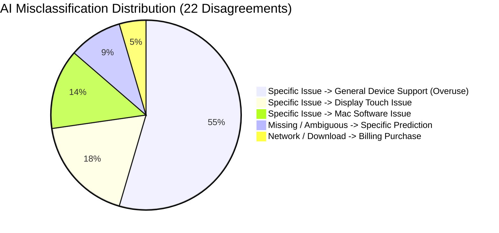

# Phase 5.7 — Human Review Error Analysis & Intent Classification Diagnostic Report

> **Project:** SupportGraph AI  
> **Evaluation Phase:** Phase 5.7 (Human-In-The-Loop Scientific Diagnostic)  
> **Benchmark Subset:** 37 Completed Human-Reviewed Records (out of 200 Golden Records)  
> **Author:** Antigravity AI Engine & Human Annotation Lead (`sridevi`)  
> **Date:** September 14, 2026  
> **Status:** Completed Diagnostic Audit (Protected Benchmark — Zero Automatic Mutations)

---

## 1. Executive Summary

During Phase 5.6 of the SupportGraph AI pipeline, an expert human annotator reviewed **37 out of 200** records in the Golden Dataset (`data/golden/golden_set_human_review.csv`). Before investing further manual effort into the remaining 163 pending records, we conducted this comprehensive empirical audit comparing **AI suggestions (`llama3.2:latest`) against authoritative human ground truth**.

### Key Findings:
1. **Low AI-Human Agreement (40.5%):** Out of 37 records, the annotator accepted 15 suggestions and overrode or reclassified 22 suggestions (59.5% disagreement rate).
2. **Massive Overuse of `general_device_support` as a Catch-All:** The model predicted `general_device_support` for **21 out of 37 records (56.8%)**, but only **9 of those 21 predictions were accurate (42.9% precision)**. The other 12 records contained distinct, specific issues (e.g., iOS 11 update regressions, Mac software glitches, hardware audio defects).
3. **Severe Specificity Blindspots:**
   * `hardware_audio_connection_issue`: 3 ground-truth cases, **0 detected by AI (0.0% Recall)**.
   * `mac_software_issue`: 3 predictions made by AI, **0 correct (0.0% Precision)**.
   * `keyboard_typing_issue`: 4 ground-truth cases, only **1 detected by AI (25.0% Recall)**; the remaining 3 were misclassified as display, Mac, or unclear.
   * `software_update_problem`: 8 ground-truth cases, only **3 detected by AI (37.5% Recall)**; 5 were dumped into `general_device_support` or `display_touch_issue`.
4. **Strategic Recommendation:** **Stop sequential manual review immediately.** The current classifier's 40.5% accuracy creates excessive cognitive fatigue for human annotators. We must **freeze the 37 reviewed records as a diagnostic development set (`D_dev`)**, upgrade the classification logic with hierarchical decision rules and targeted few-shot guidance, verify improvements against `D_dev`, and then evaluate an independent holdout set (`D_test`) from the remaining records.

---

## 2. Dataset & Review Status

| Metric | Count | Percentage | Description |
| :--- | :--- | :--- | :--- |
| **Total Golden Records** | **200** | 100.0% | Stratified sample from Apple customer support corpus |
| **AI Suggestions Completed** | **200** | 100.0% | Generated via `llama3.2:latest` in Phase 5.5 |
| **Human Reviewed (Ground Truth)** | **37** | **18.5%** | Authoritatively validated by human annotator (`sridevi`) |
| **Pending Human Review** | **163** | **81.5%** | Preserved with empty human labels (`pending_human_review`) |
| **Accepted AI Suggestions** | 15 | 40.5% | Human confirmed AI suggested label |
| **Human Overrides** | 19 | 51.4% | Human assigned different taxonomy intent |
| **Marked `unclear_needs_review`** | 3 | 8.1% | Ambiguous, non-support, or missing context |

---

## 3. AI vs. Human Agreement Analysis

```text
============================================================
AI-HUMAN CONCORDANCE BREAKDOWN (N = 37)
============================================================
Total Reviewed Records:                37
Exact Agreement (Concordance):         15 (40.54%)
Disagreement (Overrides + Divergence): 22 (59.46%)

Confidence Distribution of Reviewed Subset:
  - 0.90 – 0.95 (High Confidence):     10 records ->  6 agreed (60.0%),  4 overridden (40.0%)
  - 0.80 – 0.85 (Medium Confidence):   23 records ->  7 agreed (30.4%), 16 overridden (69.6%)
  - 0.70 – 0.75 (Low/Borderline):       3 records ->  2 agreed (66.7%),  1 overridden (33.3%)
  - < 0.70 (Critical Risk):             1 record  ->  0 agreed ( 0.0%),  1 overridden (100.0%)
============================================================
```

> **Observation:** Even among "high confidence" (0.90–0.95) predictions, **40% of records were overridden by the human expert**, demonstrating that self-reported LLM confidence is poorly calibrated against true domain specificity.

---

## 4. Confusion Matrix

The confusion matrix below maps **Human Final Ground Truth (Rows)** against **AI Predicted Intent (Columns)** across all 37 completed records:

| Human Ground Truth \ AI Prediction | `battery_power` | `billing_purchase` | `display_touch` | `general_device` | `hardware_audio` | `keyboard_typing` | `mac_software` | `software_update` | `unclear_needs` | **Total True** |
| :--- | :---: | :---: | :---: | :---: | :---: | :---: | :---: | :---: | :---: | :---: |
| **`battery_power_issue`** | **1** | 0 | 0 | 1 | 0 | 0 | 0 | 0 | 0 | **2** |
| **`billing_purchase_issue`** | 0 | **0** | 0 | 0 | 0 | 0 | 0 | 0 | 0 | **0** |
| **`display_touch_issue`** | 0 | 0 | **1** | 2 | 0 | 0 | 0 | 0 | 0 | **3** |
| **`general_device_support`** | 0 | 0 | 1 | **9** | 0 | 0 | 0 | 0 | 1 | **11** |
| **`hardware_audio_connection_issue`** | 0 | 0 | 1 | 1 | **0** | 0 | 1 | 0 | 0 | **3** |
| **`keyboard_typing_issue`** | 0 | 0 | 2 | 0 | 0 | **1** | 1 | 0 | 0 | **4** |
| **`mac_software_issue`** | 0 | 0 | 0 | 3 | 0 | 0 | **0** | 0 | 0 | **3** |
| **`software_update_problem`** | 0 | 0 | 1 | 4 | 0 | 0 | 0 | **3** | 0 | **8** |
| **`unclear_needs_review`** | 0 | 0 | 0 | 1 | 0 | 0 | 1 | 0 | **1** | **3** |
| **Total AI Predicted** | **1** | **1** | **5** | **21** | **0** | **1** | **3** | **3** | **2** | **37** |

---

## 5. Most Common Classification Errors



### Top 5 Error Patterns with Verbatim Examples:

#### Pattern 1: Dumping Specific Update Regressions into `general_device_support` (4 Cases)
* **`gold_040`**: *"Dear @115858 Please fix all your fucking issues with iOS 11. I’m sick and tired of all these bugs."*
  * **AI Prediction:** `general_device_support` (Conf: 0.80)
  * **Human Ground Truth:** `software_update_problem`
  * **Why it failed:** The model reasoned that "expressing frustration with general bugs in iOS 11 without specifying a crash" is general support, failing to recognize that OS release bugs belong to `software_update_problem`.
* **`gold_082`**: *"@AppleSupport ever since the new update my i7 has been EXTREMELY laggy, when I type the keyboard lags and opening or switching apps, everything lags. Please fix this in a new patch."*
  * **AI Prediction:** `general_device_support` (Conf: 0.80)
  * **Human Ground Truth:** `software_update_problem`
  * **Why it failed:** The customer explicitly cited causality (*"ever since the new update"*), but the model saw multiple lag symptoms and fell back to general support.

#### Pattern 2: Dumping Mac OS / App Glitches into `general_device_support` (3 Cases)
* **`gold_047`**: *"@AppleSupport photos not syncing properly between OSX high Sierra and iOS. Same problem in several versions..."*
  * **AI Prediction:** `general_device_support` (Conf: 0.80)
  * **Human Ground Truth:** `mac_software_issue`
* **`gold_086`**: *"@AppleSupport my MacBook Air has the dreaded spinning beach ball. Help please."*
  * **AI Prediction:** `general_device_support` (Conf: 0.80)
  * **Human Ground Truth:** `mac_software_issue`
  * **Why it failed:** The model saw the phrase *"Help please"* and classified it as general inquiry, ignoring the canonical macOS system hang symptom ("spinning beach ball").

#### Pattern 3: Confusing Keyboard/Autocorrect Glitches with Display Defects (2 Cases)
* **`gold_064`**: *"@AppleSupport please fix this letter “eye” problem!! I paid all this money for this phone & I’m still seeing blocks!"*
  * **AI Prediction:** `display_touch_issue` (Conf: 0.90)
  * **Human Ground Truth:** `keyboard_typing_issue`
  * **Why it failed:** The model saw *"seeing blocks"* and concluded it was a screen display problem, missing the famous iOS 11 letter "I" autocorrect bug that rendered as a unicode symbol box.

#### Pattern 4: Audio Hardware Failures Misclassified as Display or Mac (2 Cases)
* **`gold_046`**: *"@115858 @AppleSupport the music app is not producing sound. The other apps produce sound. Can play music but no sound comes out. Help. Thx."*
  * **AI Prediction:** `display_touch_issue` (Conf: 0.80)
  * **Human Ground Truth:** `hardware_audio_connection_issue`
  * **Why it failed:** The model associated "music app" with a visual interface issue rather than sound output.
* **`gold_056`**: *"Liebes @AppleSupport Team, my right speaker made weird sounds once and now the overall volume is lower than the other + there are no more heights in the sound itself anymore."*
  * **AI Prediction:** `mac_software_issue` (Conf: 0.80)
  * **Human Ground Truth:** `hardware_audio_connection_issue`
  * **Why it failed:** The model saw "MacBook" and assigned `mac_software_issue`, ignoring the specific speaker hardware/audio degradation.

#### Pattern 5: App Download Failures Misclassified as Billing (1 Case)
* **`gold_104`**: *"@AppleSupport why aren’t my apps downloading??? I’ve tried with and without WiFi..."*
  * **AI Prediction:** `billing_purchase_issue` (Conf: 0.80)
  * **Human Ground Truth:** `general_device_support`
  * **Why it failed:** The model hallucinated an App Store payment failure when the customer was troubleshooting app installation and network connectivity.

---

## 6. Intent-Level Performance Analysis

The table below calculates per-intent precision, recall, and F1-scores against the 37 ground-truth records:

| Intent Label | AI Precision | AI Recall | AI F1-Score | Human Support | Classification Health |
| :--- | :---: | :---: | :---: | :---: | :--- |
| **`battery_power_issue`** | **1.00** | 0.50 | 0.67 | 2 | 🟡 Moderate (1 shutdown dumped into General) |
| **`billing_purchase_issue`** | 0.00 | 0.00 | 0.00 | 0 | 🔴 Poor (1 False Positive) |
| **`display_touch_issue`** | 0.20 | 0.33 | 0.25 | 3 | 🔴 Severe Overprediction & False Positives |
| **`general_device_support`** | 0.43 | **0.82** | 0.56 | 11 | 🔴 Extreme Overuse as Catch-All |
| **`hardware_audio_connection_issue`**| 0.00 | 0.00 | 0.00 | 3 | 🔴 Complete Blindspot (0% Recall) |
| **`keyboard_typing_issue`** | **1.00** | 0.25 | 0.40 | 4 | 🟡 High Precision, Severe Under-Recall |
| **`mac_software_issue`** | 0.00 | 0.00 | 0.00 | 3 | 🔴 Severe Confusion with Mac Hardware |
| **`software_update_problem`** | **1.00** | 0.38 | 0.55 | 8 | 🟡 High Precision, Severe Under-Recall |
| **`unclear_needs_review`** | 0.50 | 0.33 | 0.40 | 3 | 🟡 Moderate Ambiguity Handling |
| **Overall Dataset Metrics** | **Precision: 0.56** | **Recall: 0.43** | **F1: 0.42** | **37** | **Accuracy: 40.5% (Macro F1: 0.31)** |

> [!NOTE]
> **Sample Size Notice:** Because $N = 37$, class supports range from 0 to 11. These metrics provide qualitative diagnostic direction rather than tight confidence intervals. However, the systematic failure modes (e.g. 0% audio recall, 21 predictions of general support) are statistically pronounced.

---

## 7. Taxonomy Boundary & Overlap Audit

We evaluated the operational definitions of the 10 taxonomy intents against the observed human decisions:

```mermaid
graph TD
    subgraph Specific Operational Domains
        A[account_access_issue]
        B[billing_purchase_issue]
        C[battery_power_issue]
        D[hardware_audio_connection_issue]
        E[keyboard_typing_issue]
        F[display_touch_issue]
        G[software_update_problem]
        H[mac_software_issue]
    end
    
    subgraph Fallback & Ambiguity
        I[general_device_support]
        J[unclear_needs_review]
    end
    
    Specific Operational Domains -.->|When Specific Evidence Exists| Specific Operational Domains
    Specific Operational Domains -->|Only When No Specific Intent Applies| I
    Specific Operational Domains -->|Only When Context Missing / Non-Support| J
```

### Boundary Guidelines Clarified by Human Review:

1. **`general_device_support` (Strict Fallback):**
   * **CORRECT USAGE:** WiFi connection troubles on multiple devices (`gold_088`), location tracking queries (`gold_005`), exchange/warranty inquiries (`gold_087`), messaging non-iOS users (`gold_014`).
   * **INCORRECT USAGE:** Any issue citing update regressions, Mac crashes, audio loss, or broken glass.
2. **`software_update_problem` (Causality Precedence):**
   * Applies whenever the customer cites **explicit update causality** (*"ever since the update"*, *"after updating to iOS 11"*, *"download stuck"*, *"new update is ruining my life"*).
   * Takes precedence over general lag, general bug complaints, and multi-symptom slowdowns.
3. **`mac_software_issue` (Mac Operating System & Core Apps):**
   * Applies to Time Machine, Finder, macOS sync, macOS install errors, and spinning beach ball hangs.
   * Does NOT apply to physical Mac hardware (Mac speakers -> `hardware_audio_connection_issue`; Mac keys -> `keyboard_typing_issue`).
4. **`display_touch_issue` (Physical Display & Touch Digitizer):**
   * Applies to broken glass screens, screen flickering, unresponsive touchscreens, and black screens.
   * Does NOT apply to UI text rendering errors caused by keyboard/autocorrect software glitches.
5. **`hardware_audio_connection_issue` (Sound & Audio Peripherals):**
   * Applies to speakers, microphones, AirPods, volume controls, and no-sound conditions across all apps and devices.

---

## 8. Root Cause Analysis

Every identified failure mode was traced to one or more structural causes:

| Failure Mode | Primary Root Cause | Supporting Evidence |
| :--- | :--- | :--- |
| **Overuse of `general_device_support`** | **A. Classification Rule / Prompt Weakness** | Prompt did not enforce a decision hierarchy where specific intents override general device support. |
| **0% Recall on Audio Issues** | **B. LLM Reasoning Bias** | LLM fixated on app names ("music app") or device names ("MacBook") rather than the functional symptom ("no sound", "speaker noise"). |
| **Autocorrect Glitch -> Display Touch** | **B. LLM World Knowledge / Context Blindness** | LLM did not recognize the historical iOS 11 letter "I" autocorrect bug (which rendered as a box glyph) and treated it as a display defect. |
| **Mac Speaker -> Mac Software** | **C. Entity Overriding Symptom** | LLM treated the entity "MacBook" as mutually exclusive with hardware audio. |
| **App Downloads -> Billing** | **B. LLM Hallucination** | LLM assumed app download failures are billing errors without any payment keywords in the tweet. |
| **Ambiguous Single-Device Mentions** | **D. Insufficient Message Context** | Tweets like *"it works on my phone but not my MacBook"* provide no context about "it", requiring `unclear_needs_review`. |
| **Overconfident Bad Suggestions** | **E. Uncalibrated Confidence** | LLM assigned 0.90 confidence to records that severely violated domain definitions. |

---

## 9. Recommended Classification Strategy & Prompt Architecture

To resolve these systematic weaknesses, we propose a **Hierarchical Evidence-Based Classification Architecture**:

```text
============================================================
HIERARCHICAL INTENT RESOLUTION PIPELINE
============================================================
Step 1: Check Non-Support / Pure Chatter -> unclear_needs_review
Step 2: Check Explicit Account / Credentials -> account_access_issue
Step 3: Check Explicit Billing / Subscriptions -> billing_purchase_issue
Step 4: Check Explicit Audio / Sound / Volume -> hardware_audio_connection_issue
Step 5: Check Explicit Keyboard / Typing / Autocorrect -> keyboard_typing_issue
Step 6: Check Explicit Screen / Touch / Glass -> display_touch_issue
Step 7: Check Explicit Battery / Charging / Shutdown -> battery_power_issue
Step 8: Check Explicit Update Causality / Install -> software_update_problem
Step 9: Check Mac System Behavior (Finder/Sync/Hangs) -> mac_software_issue
Step 10: Fallback to General Device Troubleshooting -> general_device_support
============================================================
```

### Proposed Prompt Rule Additions:
1. **Rule of Specificity:** If a message contains evidence for ANY specific operational intent (Steps 2–9), you MUST NOT select `general_device_support`.
2. **Rule of Causality:** Phrases like *"ever since the update"*, *"after updating"*, *"iOS 11 is glitched"*, or *"download error"* strictly map to `software_update_problem` unless an explicit component failure (e.g. keyboard autocorrect) is the sole focus.
3. **Rule of Symptom over Entity:** A hardware/audio symptom on a MacBook (e.g. speaker crackle) is `hardware_audio_connection_issue`, NOT `mac_software_issue`.
4. **Targeted Few-Shot Examples:** Include the 5 historical edge cases in the prompt (iOS 11 letter 'I' autocorrect bug, music app no sound, MacBook spinning beach ball, app download connectivity vs billing).

---

## 10. Scientific Validity & Limitations

To ensure full transparency and scientific integrity:

1. **Development vs. Evaluation Split:**
   * The **37 reviewed records are now formally designated as a Diagnostic Development Benchmark (`D_dev`)**.
   * Any improvement demonstrated by running an updated classifier on these 37 records is a **development diagnostic result (training effect)** and must NOT be reported as independent out-of-sample generalization.
2. **Holdout Evaluation Requirement:**
   * True model generalization must be verified on a separate, unobserved holdout sample (`D_test`) drawn from the remaining 163 pending records.
3. **Data Protection Guarantees:**
   * The 37 human annotations in `golden_set_human_review.csv` are **immutable ground truth** and will never be overwritten by model outputs.
   * No AI suggestions will ever be automatically copied into `annotation_label`.

---

## 11. Recommended Next Workflow

We evaluated three potential workflows:

| Option | Description | Trade-Offs | Recommendation |
| :--- | :--- | :--- | :--- |
| **Option A: Review All 163 Pending Records Now** | Continue manual review with existing 40.5% agreement AI suggestions. | **High annotator fatigue**, wasted human time overriding known repetitive errors. | ❌ NOT RECOMMENDED |
| **Option B: Sample Review Without Classifier Fix** | Review 30 more records without fixing prompt/rules. | Leaves classifier broken; does not address the 56.8% general support collapse. | ❌ NOT RECOMMENDED |
| **Option C: Improve Classifier, Verify on Dev Set, Sample Holdout** | **1. Freeze 37 records as `D_dev`.<br>2. Upgrade classification prompt/rules.<br>3. Verify on `D_dev`.<br>4. Re-generate suggestions for 163 pending records.<br>5. Sample 30–50 records for independent final test (`D_test`).** | **Scientifically rigorous, eliminates human review waste, provides true holdout validation.** | **✅ STRONGLY RECOMMENDED** |

---

## 12. Final Decision

1. **HALT manual review sessions temporarily.**
2. **LOCK the 37 completed records** in `data/golden/golden_set_human_review.csv` as ground truth.
3. **Implement the hierarchical classification prompt improvements** in `backend/app/nlp/llm_assistant.py` (pending user approval).
4. **Run a controlled Before/After evaluation experiment** on the 37-record locked benchmark.
5. **Re-generate improved AI suggestions for the remaining 163 pending records**, enabling much faster, higher-quality subsequent human review.
