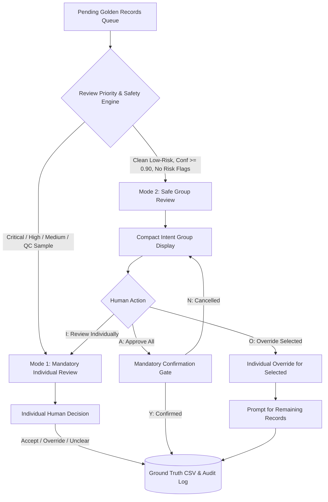

# Phase 5.8 — Safe Grouped Smart Human-in-the-Loop (HITL) Review Workflow Report

> **Project:** SupportGraph AI  
> **Phase:** 5.8 (Human-in-the-Loop Review Architecture)  
> **Target Dataset:** 200 Golden Evaluation Records  
> **Status:** Completed & Tested (All 223 Unit Tests Passing)  
> **Date:** September 14, 2026  
> **Scientific Integrity:** Zero dataset modification during software implementation; all 37 ground truth records 100% immutable; 163 pending records safely preserved.

---

## 1. Problem & Context

Creating a high-quality, scientifically defensible Golden Set ($N=200$) is critical for evaluating operational intent discovery in customer support dialogues. 

Following Phase 5.6 and Phase 5.7:
* **37 diagnostic records** have been individually verified by a human annotator as ground truth.
* **163 records remain pending human review**.
* Reviewing 163 records sequentially one-by-one is cognitively exhausting for human annotators.
* However, **automatically accepting AI predictions into ground truth violates scientific integrity** and produces contaminated evaluations.

Phase 5.8 resolves this trade-off by introducing a **Safe Grouped Smart Human-in-the-Loop (HITL)** architecture.

---

## 2. Previous Workflow Limitations

1. **Cognitive Fatigue:** In flat sequential review, annotators repeatedly evaluate high-confidence, clean complaints (e.g. obvious battery drain complaints with 0.95 confidence) one-by-one alongside difficult multi-turn edge cases.
2. **Lack of Group Confirmation Safety:** Previous batching prototypes lacked explicit confirmation gates, risking unintended batch submissions.
3. **Inflexible Adjudication:** Overriding a single misclassified item in a group risked discarding human oversight for the remaining clean items in the batch.

---

## 3. Smart HITL Design Overview

The new workflow operates across two complementary review modes:



---

## 4. Group Eligibility Criteria (10 Mandatory Conditions)

A record is eligible for Safe Group Review **if and only if** it satisfies all 10 deterministic criteria:

| # | Eligibility Rule | Verification Logic | Failure Consequence |
| :--- | :--- | :--- | :--- |
| **1** | **Priority == LOW** | `priority == 'low'` | Routes to Individual Review |
| **2** | **QC Sample == False** | `qc_sample == False` | Mandatory Individual QC Audit |
| **3** | **No Escalation Flags** | `risk_flags` contains only non-escalating tags (e.g. `high_confidence_clean`) | Routes to Individual Review |
| **4** | **No Model Review Flag** | `model_needs_human_review == False` | Routes to Individual Review |
| **5** | **Confidence $\ge 0.90$** | `model_confidence >= 0.90` (numeric valid) | Routes to Individual Review |
| **6** | **Unreviewed Record** | `annotation_label == ""` | Skipped (already completed) |
| **7** | **Pending Status** | `annotation_status in ("pending_human_review", "pending", "")` | Skipped |
| **8** | **No Priority Escalation** | Not CRITICAL, HIGH, or MEDIUM | Routes to Individual Review |
| **9** | **No Language Uncertainty** | Language evidence strength is `"none"` or `"weak"` | Routes to Individual Review |
| **10** | **No Intent Divergence** | AI suggestion matches cluster candidate or confidence is unambiguous | Routes to Individual Review |

---

## 5. Mode 1: Individual Review Path

For all high-risk, borderline, and QC-sampled records, annotators are presented with full context:
* **Metadata:** Golden ID, Tweet ID, Priority Level, Risk Score, Explainable Reason, Risk Flags.
* **Customer Opening Message & Dialogue Context.**
* **AI Suggestion, Self-Reported Confidence, Needs Review Flag, Reasoning Summary.**
* **Numbered Taxonomy Intent Menu (1–9) and Unclear option (U).**

**Actions Supported:**
* `[A]` Accept AI suggestion (available only when a valid AI suggestion exists)
* `[1-9]` Override with specific taxonomy intent
* `[U]` Mark as `unclear_needs_review`
* `[S]` Skip to next record (remains pending)
* `[Q]` Save and quit

---

## 6. Mode 2: Safe Low-Risk Group Review Path

Safe records are partitioned into deterministic bundles clustered by `model_suggested_label`:
* **Chunking:** Configurable `--group-size` (default: 10 records per group).
* **Deterministic Ordering:** `suggested_label` alphabetically, `model_confidence` descending, `golden_id` ascending.
* **Compact Display:** Shows Golden ID, Tweet ID, customer snippet, context snippet, and AI confidence.

**Group Actions:**
* `[A]` Approve ALL records with suggested label $\rightarrow$ Triggers Confirmation Gate.
* `[I]` Review records individually inside this group.
* `[O]` Override selected records.
* `[U]` Mark selected records as unclear.
* `[S]` Skip this group (leaves all records in group pending).
* `[Q]` Save and quit.

---

## 7. Confirmation Safety Mechanism

When `[A]` is selected, ground truth is **NOT** immediately written. The system renders a mandatory confirmation screen:

```text
============================================================
CONFIRM GROUP APPROVAL
============================================================
You are about to approve:

Intent:            software_update_problem
Number of records: 8

All 8 records will receive the label:
  software_update_problem

This is an explicit HUMAN GROUP APPROVAL.
AI suggestions remain advisory evidence only.

Proceed?
  [Y] Yes, approve group
  [N] No, return to review
============================================================
```

* Selecting `[Y]` commits the human group decision.
* Selecting `[N]` immediately aborts approval, returning to the group review menu without modifying records.

---

## 8. Selective Override Behavior

When `[O]` is selected:
1. The annotator inputs specific record positions (e.g. `1, 3`).
2. For each selected item, the full taxonomy menu is displayed and an override label is assigned.
3. The remaining records in the group **are NEVER automatically approved**.
4. The annotator is prompted to choose what to do with the remaining items:
   - `[A]` Approve remaining (triggers confirmation screen)
   - `[I]` Review remaining individually
   - `[S]` Skip remaining records

---

## 9. Progress Tracking & Resume Safety

The progress manifest (`data/golden/golden_annotation_progress.json`) safely records:
* Total records, human reviewed, pending review.
* Breakdown: Accepted AI suggestions, Human overrides, Unclear records.
* Audit breakdown: `group_approved_records` vs `individual_reviewed_records`.
* Session state: `current_mode`, `completed_group_ids`, `partially_reviewed_group_ids`.

The system includes **backward-compatible loading** (`load_review_progress_manifest`), allowing legacy manifests to load without error.

---

## 10. Audit Trail & Schema Safety

Every finalized annotation records a complete, non-lossy audit trail:
* `annotation_label`: Final ground-truth label approved by human.
* `annotator`: Human reviewer name (`sridevi`).
* `annotation_status`: `"reviewed"` or `"overridden_ai_suggestion"`.
* `review_mode`: `"individual_human_review"` or `"group_human_approval"`.
* `approval_type`: `"accepted_ai_suggestion"`, `"human_override"`, `"group_approved_suggestion"`, or `"unclear"`.
* `group_id`: Unique group identifier (e.g. `grp_battery_power_issue_01`).
* `approved_group_label`: Intent label of the group approved.
* `annotation_timestamp`: UTC ISO timestamp of review action.

Original AI fields (`model_suggested_label`, `model_confidence`, `model_reasoning_summary`) remain **completely untouched and separate**.

---

## 11. Scientific Integrity Guarantees

1. **Zero Auto-Copying:** AI suggestions never automatically populate `annotation_label`.
2. **Immutable Ground Truth:** Existing 37 completed human annotations remain unchanged.
3. **Mandatory Human Action:** Group approvals require explicit human selection and affirmative confirmation.
4. **Independent Evaluation Principle:** Grouped review reduces mechanical fatigue on clean items without compromising ground truth validity.

---

## 12. Automated Test Verification

All **223 unit tests pass** (`pytest backend/tests/ -v`).

Key tests in [`test_grouped_review.py`](file:///Users/sridevi/Desktop/SupportGraph-AI/backend/tests/test_grouped_review.py):
* `test_existing_human_labels_remain_unchanged` [PASSED]
* `test_safe_low_risk_records_eligible_for_grouping` [PASSED]
* `test_high_risk_records_never_enter_grouped_approval` [PASSED]
* `test_qc_sampled_records_never_enter_grouped_approval` [PASSED]
* `test_medium_risk_records_never_enter_grouped_approval` [PASSED]
* `test_group_approval_requires_explicit_confirmation` [PASSED]
* `test_cancelling_confirmation_writes_nothing` [PASSED]
* `test_group_approval_creates_individual_final_annotation_records` [PASSED]
* `test_group_approval_records_review_mode_correctly` [PASSED]
* `test_ai_suggestion_metadata_remains_separate_from_annotation_label` [PASSED]
* `test_selective_override_does_not_auto_approve_remaining_records` [PASSED]
* `test_resume_works_correctly_after_interruption_during_group` [PASSED]
* `test_old_progress_manifests_remain_compatible` [PASSED]
* `test_no_duplicate_golden_ids_created` [PASSED]
* `test_dataset_validation_passes` [PASSED]
* `test_no_pending_record_marked_completed_without_explicit_human_action` [PASSED]
